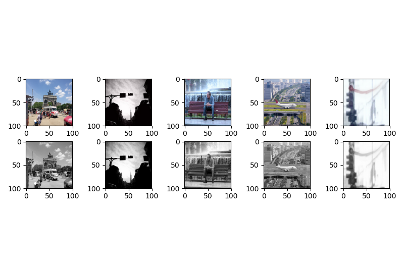

# Building Deployable Data Science Environments  

## Table of contents
1. [Introduction](#introduction)
2. [Goal of project](#goal-of-project)
3. [Description of Data](#description-of-data)
4. [Docker](#docker)
5. [Docker Compose](#docker-compose)
6. [Tensorflow GPU with Jupyter](#tensorflow-gpu-with-jupyter-notebooks)
7. [PostgreSQL](#postgresql)
  * [SQL Database](#sql-database)
4. [EDA](#exploratory-data-analysis)
5. [Modeling Methodology](#modeling-methodology)
6. [Results](#results)
7. [Future Work](#future-work)


## Introduction
Through the course of working on data science projects different package requirements are needed for different projects. Having a large catch-all environment may be able to satisfy most requirements but will be bulky and take up unnecessary space. Further, some specialized requirements will not be met by this strategy. Ultimately, with different machines running and testing the project at different times a standard environment will need to be shared between machines.  

A self-contained environment is a good solution to this problem. Requirements can be specified in a file and the environment built out to match between different machines. Another benefit of this strategy allows the project to scale up to bigger, and more powerful machines as needed. Also, additional testing and, later, solution deployment will benefit from a well defined environment keeping an entire team working with the same tools from the beginning.  

[Back to Top](#Table-of-Contents)

## Goal of project
The goal of this project is to develop a data science environment for an image recognition system that can be deployed onto GPU instances on AWS. This allows rapid model prototyping, concurrent model testing, scalability between machines, and future system deployment.  

[Back to Top](#Table-of-Contents)

## Description of data
Images are from the Common Objects in Context (COCO) dataset. COCO is a large-scale object detection, segmentation, and captioning dataset. COCO has 330K images (>200K labeled), 1.5 million object instances, and 80 object categories. They host annual image detection competitions and so datasets are categorized by the year of competition. Further separation is added between train and validation sets. The subset of images used here are filtered on traffic light images and non-traffic light, street-context from the 2017 dataset. Each dataset comes with a json file with tables for categories, images, and annotations.  

[Back to Top](#Table-of-Contents)


## Docker

Docker is a computer program that runs virtualization directly on top of the operating system. This allows applications to be run with the speed of a native install without the length and difficulties of a manual install. Apps run through docker are called containers. Their build and use is the same between machines allowing cross-platform development and deployment.

In this project containers for Tensorflow and PostgreSQL are used to provide needed tools for an image recognition project. The main prerequisite is having docker installed on the machine. For GPU computing, the Nvidia graphics driver and Nvidia-docker app are, additionally, needed. Everything else is built into the docker containers.

Many base docker images for tools like Tensorflow and PostgreSQL are provided by the teams that build the tools. These can be customized with a _Dockerfile_ that begins with the base image and adds layers of functionality or project requirements on top of it. The _Dockerfile_ used for Tensorflow in this project adds all the packages listed in the _requirements.txt_ file and any dependencies those packages may need.

Tensorflow _Dockerfile_:  
```docker
FROM tensorflow/tensorflow:latest-py3-jupyter


COPY requirements.txt requirements.txt
RUN pip install -r requirements.txt && rm requirements.txt

RUN useradd -ms /bin/ jovyan

USER jovyan

CMD ["bash", "-c", "source /etc/bash.bashrc && jupyter notebook --notebook-dir=/tf --ip 0.0.0.0 --no-browser"]
```

[Back to Top](#Table-of-Contents)


## Tensorflow-GPU with Jupyter Notebooks

The Tensorflow team provides docker images for different versions of tensorflow and support for gpu functionality as well as Jupyter Notebooks. The gpu functionality takes what is normally a long and grueling process of installing CUDA, cudnn, and other supporting libraries and distills it into the build of the tensorflow container. This in and of itself is an enormous time saver and allows rapid deployment of models to gpu-enhanced machines.

Adding Jupyter Notebooks to the container allows the machine to run a notebook server. With the right security parameters on a cloud computer, this allows access to the notebook server from any browser with the correct credentials. Jupyter notebooks are especially helpful on cloud computers which generally do not have a way to show data visualizations for exploratory data analysis and model results as well as including human-readable context for the steps taken through the project. Jupyter notebooks are generally accessed using the machine IP address at port `8888` with a token that can be printed using `jupyter notebook list` passed as a command to the docker container with `docker exec ...`.

For training large models that take hours or more, I would suggest using `screen` and `bash` instead of a Jupyter Notebook as these options allow detachment from the program while it trains while the notebook will need to be kept open to keep kernels running. From `ssh` _terminal_ at the current machine use:

```bash
$ screen -S training
$ docker exec -it scalable_ds_envs_jupyter_flow_1 bash
container@~$ python path/file.py
# ipython can also be used
```

Another tool useful with tensorflow is `Tensorboard`. Tensorboard tracks and visualizes the metrics of a tensorflow model, it's weights and gradients, and a model graph while the model is training. Tensorboard runs a local server that is accessed through a web browser. The model training must use the `Tensorboard` callback to utilize this tool. Again, with the right security parameters, the Tensorboard server can be accessed from any web browser outside of the system. This is useful to quickly check on the progress of a larger model training while being detached from the system. The Tensorboard server is started with `tensorboard --logdir=logs/` passed to the docker container using `docker exec ...`. It is accessed using the machine IP address at port `6006`.


[Back to Top](#Table-of-Contents)


## PostgreSQL

[Back to Top](#Table-of-Contents)


## Docker Compose


[Back to Top](#Table-of-Contents)


## SQL Database
To manage all the images and annotations a PostgreSQL database is created to hold image metadata and image annotation data. As images are downloaded their local path is recorded into the database for quick access later on. A data pipeline class helps to connect python to the database. The data pipeline is built on top of `psycopg2`.

```python
class DataPipeline(object):
    def __init__(self, dataset, user, host, db_prefix='coco_', data_dir=None):
        ...
        self.connect_sql(dbname=dbname, user=user, host=host)

    def __del__(self):
        self.cursor.close()
        self.connxn.close()

    def __enter__(self):
        return self
    def __exit__(self, exc_type, exc_value, traceback):
        self.__del__()

    def connect_sql(self, dbname, user='postgres', host='/tmp'):
        print('Connecting to PostgreSQL server....')
        self.connxn = connect(dbname=dbname, user=user, host=host)
        print('\tConnected.')
        self.cursor = self.connxn.cursor()
```
A class for building the database and loading and inserting all the metadata helps to keep the database structure the same between datasets such as train and validation as well as datasets from previous or future years. New tables filtered down to the current scope of the project make access to data quick and the ability to create new views allow the project scope to expand as needed.

```python
class BuildDatabase(DataPipeline):
    ...
    def build_sql(self, coco_dir):
      ...
    def load_json(self, coco_dir):
      ...
    def create_tables(self, file):
      ...
    def insert_into_table(self, table_name, dict_lst, pages=100):
      ...
```
The `QueryDatabase` class facilitates running queries that return into a `pandas.DataFrame`. From there a list of image paths can be served to the models' `ImageDataGenerator` using the `get_images` method which checks if the image has been downloaded yet (downloading if necessary). As images are downloaded their absolute path is recorded and updated into the SQL database.

```python
class QueryDatabase(DataPipeline):
    ...
    def query_database(self, query=None):
      ...
    def download(self, image_id, image_name, image_url):
      ...
    def update_sql(self, table, id, field, value):
      ...
    def get_images(self):
      ...
```  

[Back to Top](#Table-of-Contents)


## Exploratory Data Analysis
Within this database there are ~27,000 street-context images of which ~4,000 contain traffic lights. The size of the traffic lights in each image vary and some images have multiple traffic lights in them. The street-context subset is filtered on road vehicle and outdoor supercategories. Image sizes range from (52-640) x (59-640).


  

[Back to Top](#Table-of-Contents)

## Modeling Methodology
The current model used is modeled after [AlexNet](https://papers.nips.cc/paper/4824-imagenet-classification-with-deep-convolutional-neural-networks.pdf) an 8-layer convolutional neural network. The first (5) layers are convolutional layers that learn filters to apply to the image to make sense of what is in an image. The last (3) layers are fully-connected layers that take the filtered, simplified images and try to learn what makes up a traffic light. AlexNet was originally run in parallel on two GTX 580 graphics cards with 3GB of memory each.  

[Back to Top](#Table-of-Contents)

## Results
The first model has begun to train. The size had to be reduced to fit on the GPU memory. Cross validation will be used to tune the model hyperparameters.  

[Back to Top](#Table-of-Contents)

## Future Work  
* copy and adapt Tensorflow Dockerfile source to use conda and install needed dependencies within image rather than in shell script  

Train, train, trian train...
Look at other model architectures, ResNet, Inception models.  

[Back to Top](#Table-of-Contents)
