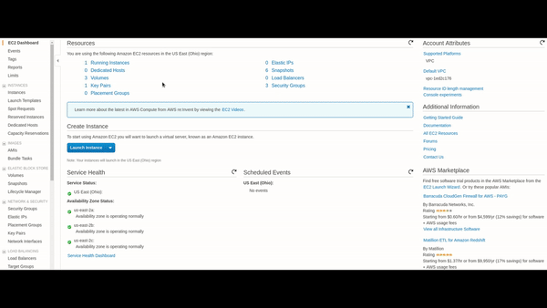
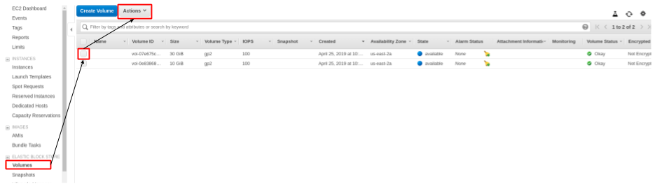

# Initial Setup
## Overview
1. [Preparing the data](#preparing-the-data)
   * [Storage Volume Setup](#storage-volume-setup)
2. [Setting up an Instance template](#Setting-up-an-instance-template)
2. [Starting the Data Science Environment](#starting-the-data-science-environment)
3. [PostgreSQL](#postgresql)

## Preparing the data  
Initial setup of the data science environment should take into consideration the data that will be used. In this project I am using the COCO 2017 dataset. This includes training and validation data and annotations which take up 19 Gb and 1 Gb, respectively. I found it helpful to give each dataset its own storage volume and snapshot to be attached to new machine instances that are built.  



On AWS, I instantiated a t2 machine with Amazon Linux on it and two additiional storage volumes with enough space to fit each dataset. The steps to set this up are as follows:  
1. Initialize EC2 instance with attached storage volumes
2. `ssh` into the instance  


### Storage volume setup
AWS uses Elastic Block Storage (EBS) as their storage volume system. We will utilize these, and snapshots, to hold our data (_from_ [_AWS docs - ebs volumes_](https://docs.aws.amazon.com/AWSEC2/latest/UserGuide/ebs-using-volumes.html)).  
1. List the block devices connected to instance and determine which _block name_ is the EBS storage (it should be the unmounted block)  
```bash
ubuntu@ip-xxx-xx-xx-xx:~$ lsblk
NAME        MAJ:MIN RM SIZE RO TYPE MOUNTPOINT
loop0         7:0    0  91M  1 loop /snap/core/6350
loop1         7:1    0  18M  1 loop /snap/amazon-ssm-agent/930
nvme0n1     259:0    0  50G  0 disk
nvme1n1     259:1    0   8G  0 disk
└─nvme1n1p1 259:2    0   8G  0 part /
```

2. New EBS volumes do not have a filesystem  
```bash
ubuntu@ip-xxx-xx-xx-xx:~$ sudo file -s /dev/nvme0n1
/dev/nvme0n1: data
```  
so we need to make one  
```bash
ubuntu@ip-xxx-xx-xx-xx:~$ sudo mkfs -t xfs /dev/nvme0n1
```  
now the block should have a file system  
```bash
ubuntu@ip-xxx-xx-xx-xx:~$ sudo file -s /dev//nvme0n1
/dev//nvme0n1: SGI XFS filesystem data (blksz 4096, inosz 512, v2 dirs)
```

3. Now we need to mount the EBS filesystem to a directory in our current filesystem  
```bash
ubuntu@ip-xxx-xx-xx-xx:~$ mkdir data
ubuntu@ip-xxx-xx-xx-xx:~$ sudo mount /dev/nvme0n1 data/
```
4. Now download the data and annotations to the data directory, unzip it and then remove the zip file. First we give ownership of this mount dir to our user and install unzip (base AWS AMIs don't come with unzip for some reason). The images are also brought to the root of the storage volume to simplify file pathing.  
```bash
ubuntu@ip-xxx-xx-xx-xx:~$ sudo chown -R $USER:$USER data/
ubuntu@ip-xxx-xx-xx-xx:~$ sudo apt install unzip
ubuntu@ip-xxx-xx-xx-xx:~$ cd data/
ubuntu@ip-xxx-xx-xx-xx:~/data$ wget http://images.cocodataset.org/zips/train2017.zip
ubuntu@ip-xxx-xx-xx-xx:~/data$ unzip train2017.zip
ubuntu@ip-xxx-xx-xx-xx:~/data$ find train2017/ -name *.jpg exec mv {} ./ ;\
ubuntu@ip-xxx-xx-xx-xx:~/data$ rm train2017.zip
# prepare the annotations
ubuntu@ip-xxx-xx-xx-xx:~/data$ mkdir annotations
ubuntu@ip-xxx-xx-xx-xx:~/data$ wget http://images.cocodataset.org/annotations/annotations_trainval2017.zip
ubuntu@ip-xxx-xx-xx-xx:~/data$ unzip annotations_trainval2017.zip -d annotations/
ubuntu@ip-xxx-xx-xx-xx:~/data$ rm annotations_trainval2017.zip
```

5. Our data is now saved to an EBS volume we can terminate the instance (storage volumes will persist if `Delete on Termination` isn't checked).

6. Save the data as a snapshot. This allows the minimization of storage costs since snapshots are stored at s3 level pricing rather than EBS pricing level. Also, this allows the data to be used by multiple machine with their own version of the data. Select the volume to create a snapshot of and click `Create Snapshot` from the `Actions` drop down menu  

     

7. Once the volume snapshots are completed (this can take a little while depending on the size of the data) the volumes should be `Terminated` so that charges for keeping them live don't keep accumulating.

[Back to top](#overview)


## Setting up an Instance template
> **UNDER CONSTRUCTION** This is where I will talk about how to setup instance templates

## Starting the Data Science environment  
The first thing to do in an aws instance is to clone the repo:  
```bash
git clone https://github.com/mosqueteiro/detecting_trafficlights.git && \
cd detecting_trafficlights
```

Then the aws_setup.sh script:
```bash
sudo chmod +x aws_setup.sh
bash aws_setup.sh
```

[Back to top](#overview)


## PostgreSQL
### Starting the postgres server in a container

Let's create & start up a container with the official postgres image. Here I've named the container `pgserv`, but you can call it anything.
```
$ docker run --name pgserv -d -p 5435:5432 -v "$PWD":/home/data postgres
```
- the `-d` flag means "run this container in the background"
- `-p 5435:5432` means "connect port 5435 from this computer (localhost) to the container's port 5432". This will allow us to connect to the Postgres server (which is inside the container) from services running outside of the container (such as python, as we'll see later).

In the future, you can start this container by using the `docker start` command
```bash
$ docker start pgserv
```

### Accessing the postgres terminal, [psql](http://postgresguide.com/utilities/psql.html)

`psql` is the command to open up a postgres terminal, and we need to run this command on inside the container. `docker exec` is the way to execute commands in a running container. See the documentation [here](https://docs.docker.com/engine/reference/commandline/exec/)
```
$ docker exec -it pgserv psql -U postgres
=# CREATE DATABASE yeah;
=# CREATE TABLE whatever ... ;
=# SELECT * FROM whatever
=# \q
```

### Loading data into the server from a local file

Say we have a database dump on our machine called `really_important.sql`, and we'd like to load it into our containerized postgres server and run some queries on it.

First, make sure the data file is in the folder that was mounted as a volume when you created the `pgserv` container. For example, if you ran the `docker run` command from `~`, make sure that `really_important.sql` is in some sub-folder of `~`.

Suppose the data is in `~/path/to/data_dump/really_important.sql`. We can access it from the container as follows:  

```
$ docker exec -it pgserv bash
# cd /home/data/path/to/data_dump/
# psql -U postgres
=# CREATE DATABASE new_database;
=# \q
# psql -U postgres new_database < really_important.sql;
# psql -U postgres new_database
=# \d
=# SELECT * FROM critical_table LIMIT 13;
```

[Back to top](#overview)
